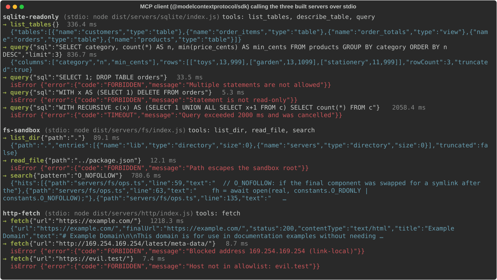

# mcp-servers

> **Credits.** Built by Amaan Mithani with Claude (Anthropic) as the AI coding assistant.

Three small, read-only [Model Context Protocol](https://modelcontextprotocol.io) servers in
TypeScript, built on the official `@modelcontextprotocol/sdk` (v1.30). Each one gives an LLM
access to a resource that is dangerous to expose naively, and each is built around a guard
that is unit-tested against the specific attack it exists to stop.

| Server            | Tools                                    | What it guards against                                              |
| ----------------- | ---------------------------------------- | ------------------------------------------------------------------- |
| `sqlite-readonly` | `list_tables`, `describe_table`, `query` | writes, stacked statements, runaway queries, huge result sets       |
| `fs-sandbox`      | `list_dir`, `read_file`, `search`        | path traversal, symlink escapes, oversized/binary files, ReDoS      |
| `http-fetch`      | `fetch`                                  | SSRF (private IPs, cloud metadata, DNS rebinding, redirects), bombs |

Shared by all three (`src/lib/`): config from a JSON file plus env overrides (validated with
zod), a token-bucket rate limit per tool, JSON-lines logging to **stderr only** (stdout is the
MCP stdio channel), and one error shape for every failure.

**Headline number:** a `sqlite-readonly` `query` call (primary-key lookup) takes
**0.308 ms p50 / 1.568 ms p99** round trip over stdio, across 2,000 sequential calls. That is
the full `client.callTool()` path: JSON-RPC over pipes, zod input validation, the worker-thread
hop, and output-schema validation. It was measured by [`scripts/bench.ts`](scripts/bench.ts) on
an Apple M1 Pro with Node v25.9.0. The raw output is in
[`results/bench.json`](results/bench.json). The machine was busy during the run (1-minute load
average about 26), so treat these as upper bounds.

## See it running



Local run, 2026-09-26: a throwaway client script using the SDK's `Client` and
`StdioClientTransport` spawned each built server (`dist/servers/*/index.js`) and called its
tools. The SQLite server used the committed `data/sample.db`, `fs-sandbox` had `FS_ROOT=src`,
and `http-fetch` fetched the live `https://example.com/`. Output is as printed; long results
are cut with `…`.

## Why these guards matter

An MCP server acts with the user's permissions, but its arguments come from a model, and a
model can be steered by any text it reads, such as a web page, a README or a database row. The
safe way to think about it is that **every tool argument is attacker-controlled**. The table
below lists one concrete attack per guard, and each attack is a test case in this repo.

### sqlite-readonly

| Attack                                                                                                             | Guard                                                                                                                                                                                                                               |
| ------------------------------------------------------------------------------------------------------------------ | ----------------------------------------------------------------------------------------------------------------------------------------------------------------------------------------------------------------------------------- |
| Injected text makes the model run `SELECT 1; DROP TABLE orders`                                                    | better-sqlite3 refuses to prepare a string that holds more than one statement → `FORBIDDEN`                                                                                                                                         |
| `WITH x AS (SELECT 1) DELETE FROM orders` (starts like a read)                                                     | SQLite compiles the statement and `stmt.readonly` (`sqlite3_stmt_readonly`) must be true, so the text prefix alone never grants access                                                                                              |
| `ATTACH '/other.db' AS x`, `PRAGMA writable_schema=1`, `BEGIN`                                                     | SQLite reports these as "read-only", so a keyword check also requires the statement to start with `SELECT`/`WITH`/`VALUES` and `stmt.reader` to be true                                                                             |
| A guard bug                                                                                                        | The connection is opened `readonly: true`, `fileMustExist`, with `PRAGMA query_only=ON`. Writes fail at the engine level anyway                                                                                                     |
| A hostile `.db` file whose views call side-effecting functions                                                     | `PRAGMA trusted_schema=OFF`                                                                                                                                                                                                         |
| `WITH RECURSIVE c(x) AS (SELECT 1 UNION ALL SELECT x+1 FROM c) SELECT count(*) FROM c` (never returns, pins a CPU) | Queries run in a worker thread. When the timeout fires the worker is **terminated**, which kills the query, and a fresh worker starts on the next call. better-sqlite3 has no progress-handler API, so this can't be done in-thread |
| `SELECT * FROM events` against 50M rows                                                                            | Rows are streamed with `stmt.iterate()` and iteration stops at `maxRows`, so the table is never materialised. The result reports `truncated: true`                                                                                  |

### fs-sandbox

| Attack                                                                                     | Guard                                                                                                                                       |
| ------------------------------------------------------------------------------------------ | ------------------------------------------------------------------------------------------------------------------------------------------- |
| `read_file("../../.ssh/id_rsa")`                                                           | Lexical check: the path is resolved against the root and must stay inside it. `root-sibling/` is not treated as inside `root/`              |
| A repo you open contains `notes.md -> ~/.aws/credentials` (a planted symlink)              | Physical check: `realpath()` resolves every symlink, including chains and directory links, and the result must be inside the canonical root |
| The final path component is swapped for a symlink between the check and the read (TOCTOU)  | Files are opened with `O_NOFOLLOW`, so the swap makes `open()` fail instead of following the link                                           |
| `search` walks into a symlinked directory that points to `/`                               | Search never follows symlinks and re-checks every path it visits                                                                            |
| `search({ pattern: "(a+)+$", regex: true })` (catastrophic backtracking hangs the process) | Regexes run inside a `vm` context with a timeout. V8 interrupts even a regex that is mid-backtrack, and the call returns `TIMEOUT`          |
| `read_file("huge.log")` or a binary file                                                   | Reads are capped at `maxReadBytes` (the result reports `truncated`). Files with a NUL byte in the first 8 KiB are rejected                  |

### http-fetch

| Attack                                                                                           | Guard                                                                                                                                                                                                            |
| ------------------------------------------------------------------------------------------------ | ---------------------------------------------------------------------------------------------------------------------------------------------------------------------------------------------------------------- |
| A page tells the model to fetch `http://169.254.169.254/latest/meta-data/iam/...`                | Host allowlist first, then the address is checked against blocked ranges: loopback, RFC 1918, link-local, CGNAT, multicast, reserved, documentation, ULA and more                                                |
| `evil.example` is allowlisted but its DNS returns `127.0.0.1` (or switches to it: DNS rebinding) | The check runs **after** DNS resolution, inside the `lookup` hook that `http.request` uses to connect. The socket connects only to addresses that passed the check, so nothing changes between check and connect |
| DNS returns `[1.2.3.4, 10.0.0.5]`                                                                | Every resolved address must pass, not just the first one                                                                                                                                                         |
| `http://[::ffff:127.0.0.1]/`, `http://[64:ff9b::a00:1]/`, `http://[2002:7f00:1::]/`              | IPv4-mapped, NAT64 and 6to4 addresses are unwrapped and the embedded IPv4 address is checked                                                                                                                     |
| `http://0x7f.1/`, `http://2130706433/`, `http://0177.0.0.1/`                                     | The WHATWG URL parser normalises these to `127.0.0.1` before any check runs                                                                                                                                      |
| An allowed host returns `302 Location: http://169.254.169.254/`                                  | Redirects are followed manually and each hop is re-checked for scheme, port, host and IP. There is a `maxRedirects` cap                                                                                          |
| A 10 KB gzip response that expands to 10 GB                                                      | The byte cap applies to **decompressed** output. The stream is cut off at `maxBytes` and the result reports `truncated`                                                                                          |
| A slow server that sends one byte per minute                                                     | A single deadline (`timeoutMs`) covers DNS, connect, all redirects and the body                                                                                                                                  |
| `file:///etc/passwd`, `http://user:pw@host/`, `http://host:22/`                                  | Schemes are allowlisted (`https` only by default). URLs with embedded credentials are rejected. Ports are allowlisted (80 and 443 by default)                                                                    |

## Install and build

```bash
npm ci
npm run build          # -> dist/servers/{sqlite,fs,http}/index.js
npm run sample-db      # regenerates data/sample.db (already committed)
```

Requires Node >= 22.18. The test suite runs servers from `.ts` source using Node's built-in
type stripping. The built `dist/` needs only Node.

## Add to Claude Desktop (or any MCP client)

Edit `claude_desktop_config.json`:

- macOS: `~/Library/Application Support/Claude/claude_desktop_config.json`
- Windows: `%APPDATA%\Claude\claude_desktop_config.json`

Use absolute paths:

```json
{
  "mcpServers": {
    "sqlite": {
      "command": "node",
      "args": ["/abs/path/mcp-servers/dist/servers/sqlite/index.js"],
      "env": { "SQLITE_DB_PATH": "/abs/path/mcp-servers/data/sample.db" }
    },
    "files": {
      "command": "node",
      "args": ["/abs/path/mcp-servers/dist/servers/fs/index.js"],
      "env": { "FS_ROOT": "/Users/me/projects/notes" }
    },
    "web": {
      "command": "node",
      "args": ["/abs/path/mcp-servers/dist/servers/http/index.js"],
      "env": { "HTTP_ALLOWED_HOSTS": "docs.python.org,developer.mozilla.org,*.github.io" }
    }
  }
}
```

Other clients use the same `command`/`args`/`env` shape, for example Claude Code:

```bash
claude mcp add sqlite -e SQLITE_DB_PATH=/abs/path/data/sample.db -- node /abs/path/dist/servers/sqlite/index.js
```

## Configuration reference

Each server reads an optional JSON config file, whose path comes from the env var in the table
header. Env vars override values from the file, and defaults apply to anything left unset. The
merged config is validated at startup. If it is invalid, the server logs a `fatal` JSON line to
stderr and exits with code 1.

**Common to all servers**

| JSON key                    | Env var                   | Default | Meaning                                |
| --------------------------- | ------------------------- | ------- | -------------------------------------- |
| `logLevel`                  | `MCP_LOG_LEVEL`           | `info`  | `debug` \| `info` \| `warn` \| `error` |
| `rateLimit.capacity`        | `MCP_RATE_CAPACITY`       | `30`    | burst size per tool (token bucket)     |
| `rateLimit.refillPerSecond` | `MCP_RATE_REFILL_PER_SEC` | `10`    | sustained calls/second per tool        |

**sqlite-readonly** (config file: `SQLITE_MCP_CONFIG`)

| JSON key    | Env var             | Default    | Meaning                                             |
| ----------- | ------------------- | ---------- | --------------------------------------------------- |
| `dbPath`    | `SQLITE_DB_PATH`    | (required) | SQLite file, opened read-only                       |
| `maxRows`   | `SQLITE_MAX_ROWS`   | `500`      | hard row cap (`query.limit` can only lower it)      |
| `timeoutMs` | `SQLITE_TIMEOUT_MS` | `2000`     | per-query wall clock; the worker is killed after it |

**fs-sandbox** (config file: `FS_MCP_CONFIG`)

| JSON key             | Env var                | Default    | Meaning                                    |
| -------------------- | ---------------------- | ---------- | ------------------------------------------ |
| `root`               | `FS_ROOT`              | (required) | sandbox root (canonicalised at startup)    |
| `maxReadBytes`       | `FS_MAX_READ_BYTES`    | `262144`   | `read_file` cap                            |
| `maxListEntries`     | none                   | `1000`     | `list_dir` cap                             |
| `maxSearchResults`   | none                   | `200`      | `search` hit cap                           |
| `maxSearchFiles`     | none                   | `5000`     | files visited per search                   |
| `maxSearchFileBytes` | none                   | `1048576`  | larger files are skipped by `search`       |
| `searchTimeoutMs`    | `FS_SEARCH_TIMEOUT_MS` | `3000`     | total search budget (including regex time) |

**http-fetch** (config file: `HTTP_MCP_CONFIG`)

| JSON key         | Env var                | Default                  | Meaning                                                              |
| ---------------- | ---------------------- | ------------------------ | -------------------------------------------------------------------- |
| `allowedHosts`   | `HTTP_ALLOWED_HOSTS`   | (required)               | exact hosts or `*.suffix` wildcards (subdomains only)                |
| `allowedSchemes` | `HTTP_ALLOWED_SCHEMES` | `["https"]`              | `http` and/or `https`                                                |
| `allowedPorts`   | none                   | `[80, 443]`              | destination ports                                                    |
| `allowCidrs`     | `HTTP_ALLOW_CIDRS`     | `[]`                     | private ranges to exempt on purpose (logged as a warning at startup) |
| `maxBytes`       | `HTTP_MAX_BYTES`       | `1000000`                | cap on the decompressed body                                         |
| `timeoutMs`      | `HTTP_TIMEOUT_MS`      | `10000`                  | one deadline for the whole fetch, including redirects                |
| `maxRedirects`   | `HTTP_MAX_REDIRECTS`   | `5`                      |                                                                      |
| `userAgent`      | none                   | `mcp-http-fetch/0.1 ...` |                                                                      |

Env list values are comma-separated. Example `http.json`:

```json
{
  "allowedHosts": ["docs.python.org", "*.readthedocs.io"],
  "maxBytes": 500000,
  "rateLimit": { "capacity": 10, "refillPerSecond": 1 }
}
```

## Results and errors

A successful call returns `structuredContent` that matches the tool's declared `outputSchema`,
plus a text copy in `content`. SQL results come back as `{ columns, rows, rowCount, truncated }`
with rows as arrays, so duplicate column names survive. Integers outside JS's safe range come
back as strings. BLOBs come back as `{ blobBase64, bytes, truncated }`.

Every failure is an `isError: true` result whose text content is
`{"error":{"code","message"}}`. The possible codes are `INVALID_INPUT`, `NOT_FOUND`, `FORBIDDEN`,
`RATE_LIMITED` (which includes `details.retryAfterMs`), `TOO_LARGE`, `TIMEOUT`,
`UPSTREAM_ERROR` and `INTERNAL`. `INTERNAL` never includes stack traces or internal messages.
The error payload goes in `content` rather than `structuredContent` because MCP clients
validate `structuredContent` against the tool's success schema.

## Development

```bash
npm run lint           # eslint (flat config); `no-console` is an error in src/ to protect stdout
npm run typecheck      # tsc --noEmit, strict + noUncheckedIndexedAccess
npm run format:check   # prettier
npm run test:coverage  # vitest + v8 coverage, thresholds 75% enforced in vitest.config.ts
npm run build
npm run bench          # build, then write results/bench.json
```

Tests (167 total):

- `test/unit/*Guard*.test.ts`, `ipguard.test.ts`: the guards, tested against real temp
  directories with real symlinks (escapes, chains, loops, dangling links, a symlinked root) and
  against IPv4, IPv6, IPv4-mapped, NAT64, 6to4, Teredo and obfuscated IPv4 literals.
- `test/unit/fetcher.test.ts`: a local HTTP server plus a fake resolver that simulates hostile
  DNS. Covers rebinding, mixed answers, redirects to metadata, gzip bombs, slow bodies and
  content-type rejection.
- `test/unit/servers.test.ts`: each server's MCP surface in-process (InMemoryTransport),
  including rate limiting and the query-timeout kill-and-recover path.
- `test/integration/stdio.test.ts`: spawns each server as a child process and calls every tool
  through the SDK's `StdioClientTransport`.

## Limitations (known, deliberate)

- **fs-sandbox TOCTOU:** `O_NOFOLLOW` protects only the final path component. If an attacker can
  write inside the root and swap an intermediate directory for a symlink in the microseconds
  between `realpath()` and `open()`, the race is theoretically winnable. Closing it fully
  requires `openat2(RESOLVE_BENEATH)`, which is Linux-only and not exposed by Node. The threat
  model assumed here is a hostile _model_, not a hostile local process that is racing you.
- **http-fetch** does not support HTTP proxies. With a proxy, the proxy (not this process)
  resolves DNS, and the IP check would be bypassed.
- The HTML-to-text converter is a small regex-based converter with no dependencies, not a full
  HTML parser. It is good enough for docs and articles, but not for pages that render with
  JavaScript.
- sqlite queries are serialised through a single worker per server process. That is fine for a
  single-user desktop client, but not built for high concurrency.
- Coverage (v8, 94% of statements, 89% of branches) excludes the three `index.ts` entrypoints,
  `lib/run.ts` and the sqlite `worker.ts` shell. They run in child processes and worker threads
  that in-process v8 coverage cannot see. They are exercised by the stdio integration tests
  instead.
